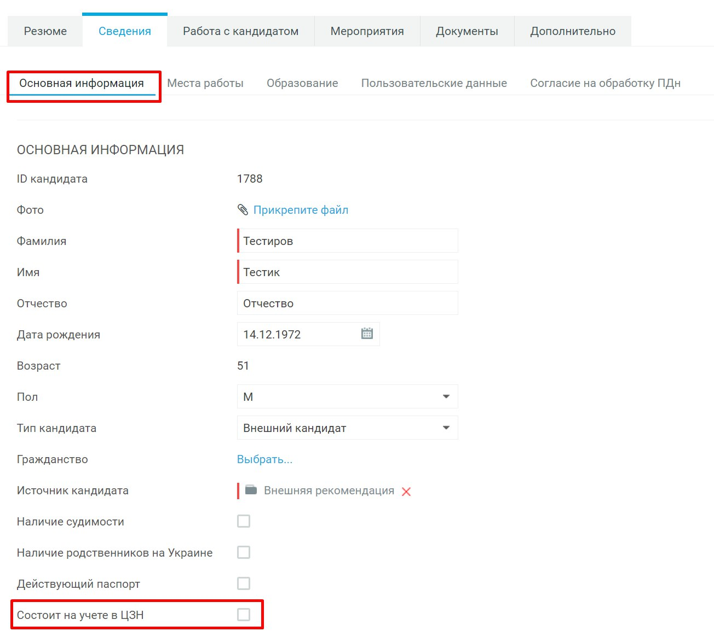

---
jupytext:
  text_representation:
    extension: .md
    format_name: myst
    format_version: 0.13
    jupytext_version: 1.15.2
kernelspec:
  display_name: Python 3 (ipykernel)
  language: python
  name: python3
---

(mirapolis_new)=
# Обновления

## 12.01.2024 Карточка кандидата

В карточке кандидата в разделе основная информация добавлено поле ""Состоит на учете в ЦЗН" . Чек-бокс в данном поле проставляется если от кандидата получена информация о том, что он состоит на учете в ЦЗН в качестве безработного.

